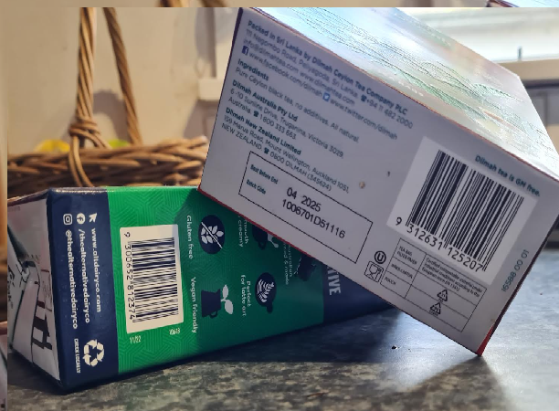
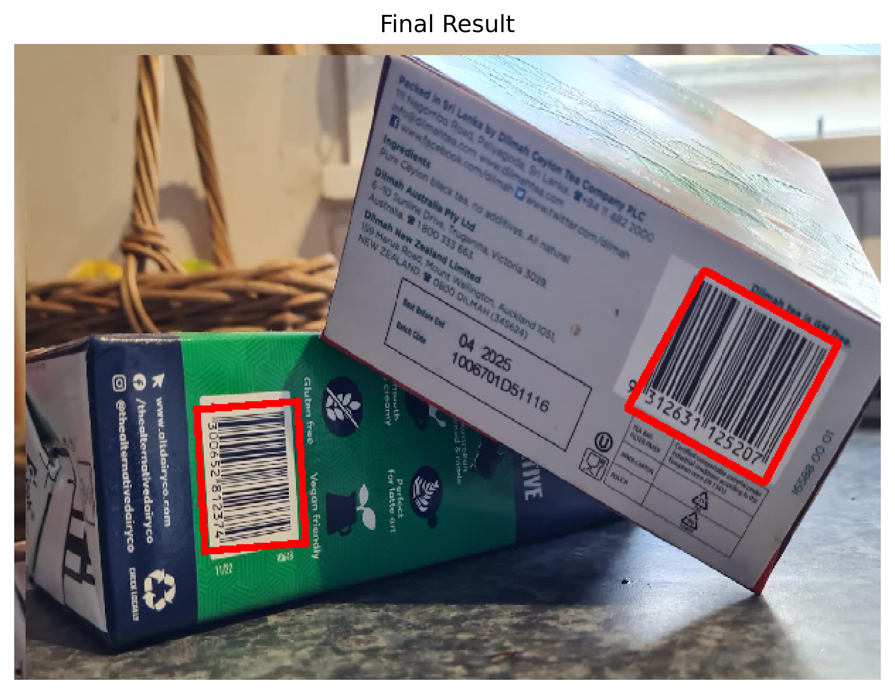

# Barcode Detection Project

## Overview
This project introduces a barcode detection algorithm designed to efficiently and accurately identify barcodes in images. Utilising advanced image processing techniques, the project aims to optimise performance while minimising dependency on third-party modules. Key features include the ability to detect multiple barcodes within a single image, the generation of precisely aligned bounding boxes around each detected barcode, and an educational animation that illustrates the barcode detection process. The whole process was done with only base python and matplotlib as an extra challenge.

## Main Features

### 1. Efficient Code Structure
- Enhanced time complexity and code organisation.
- Quality of life enhancements.
- Improved static image plot pipeline and logic.
- Code modularisation for readability and maintenance.
- Implementation of efficient algorithms, including Gaussian and Sobel kernels, depth-first search.

### 2. Multiple Barcode Detection
- Capability to detect multiple barcodes in a single image.
- Draws significant components based on a predefined area threshold.

### 3. Aligned Bounding Box
- Method for creating an optimally aligned bounding box around each barcode.
- Intricate calculations for best fit, including a 'bloat' factor for box size adjustments.

### 4. Animation
- Educational tool to demonstrate the barcode detection process.
- Created using Python and Matplotlib for a smooth and informative experience.

## Preview

## Future Work
- Fix bugs.
- Massive clean up.

## Contact
Email: christopherjthomaswork@gmail.com
